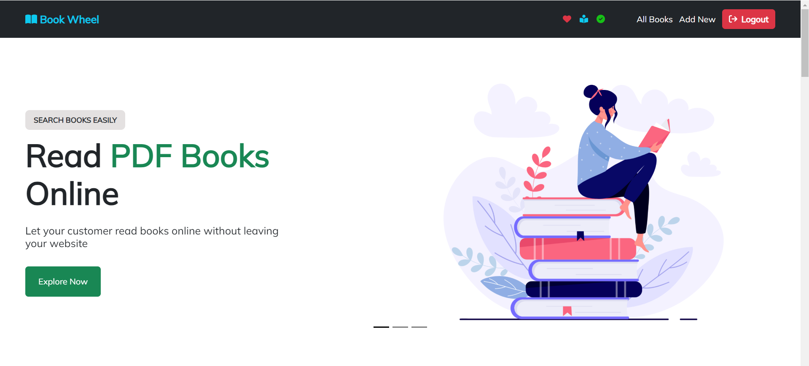

<h1 align='center'>
<a href='https://book-catalog-abf42.web.app/' target='_blank'>
Book Wheel</a>
</h1>

<b>Online Book Reading Website</b>

### Client Side Link : [https://github.com/Tasnim-Pricila/book-catalog](https://github.com/Tasnim-Pricila/book-catalog)
### Backend Side Link : [https://github.com/Tasnim-Pricila/book-catalog-backend](https://github.com/Tasnim-Pricila/book-catalog-backend) 
### Website Live Link : [https://book-catalog-abf42.web.app/](https://book-catalog-abf42.web.app/) 

## **Project Description**
### **Tools and Technologies Used** :

* HTML
* CSS
* Bootstrap
* React JS
* Redux-Toolkit
* Typescript 
* Firebase 
* Node Js
* Express Js
* MongoDB
* Mongoose

### **About Project** :

1. This is a Single-Page-Application website of a book reading website.
2. Users can filter products on various types.
3. Users can wishlist any product.
4. Users can add their reviews for the books.
5. User is able to create, update or delete any books.
6. Website is responsive for all screen sizes.

For testing, you can create a new product. Update or delete anything you created and try out the things.

(If you liked the project, give it a star 😃)

